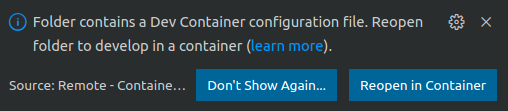
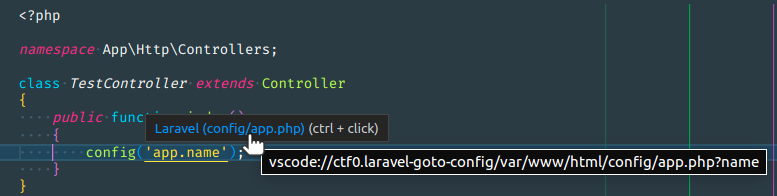

Repository reproduce the issue with vscode crash and restart when using [ctf0/laravel-goto-config](https://github.com/ctf0/laravel-goto-config) extension inside [remote containers](https://code.visualstudio.com/docs/remote/containers). This is barebone laravel setup after following steps in [installation via composer](https://laravel.com/docs/9.x/installation#installation-via-composer) and [using devcontainers](https://laravel.com/docs/9.x/sail#using-devcontainers)

## Setup

- `docker` and `docker-compose` need to be installed to run [laravel sail](https://laravel.com/docs/9.x/sail)
- install [remote containers vscode extension](https://marketplace.visualstudio.com/items?itemName=ms-vscode-remote.remote-containers)

## Steps to reproduce the issue

- run `./vendor/bin/sail up -d --build` to start the stack
- open project folder in vscode
- notification will show up: `Folder contains a Dev Container configuration file. Reopen folder to develop in a container`. Click on `Reopen in Container` button. Vscode will restart and it will open vscode connected to the container. Since it's first run, it will take few seconds to initialize and install extension

- open controller `app/Http/Controllers/TestController.php`
- click on the `config('app.name');` link
- vscode will crash and restart

When I hover on the `config('app.name')` link shows `vscode://ctf0.laravel-goto-config/var/www/html/config/app.php?name`

Laravel app in the container is `/var/www/html`

To stop the containers run `./vendor/bin/sail down`
